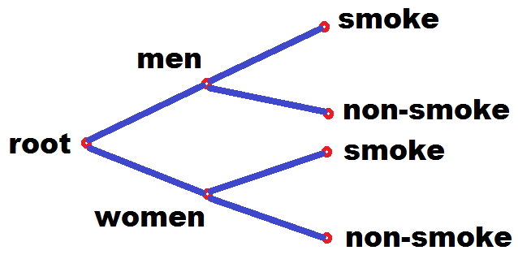
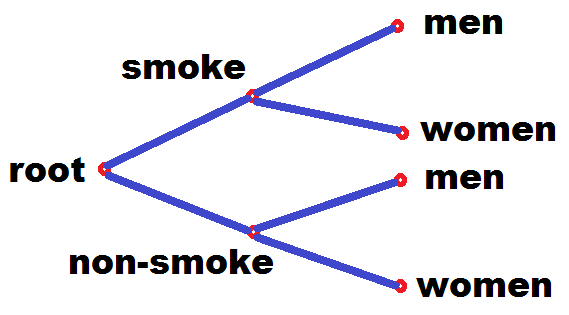
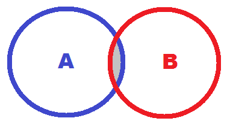

```{r setup, include=FALSE}
knitr::opts_chunk$set(echo = TRUE)
```
  
## Contingency table, statistics and independence

Here we will present a first study about Contingency Table, and observe if the classes belonging to the table are independent or not, that means: - are they independent or not? The statistics that we will use is the chi-square statistics, or better, chi-square hypothesis test.  
  
<br>

### Contingency Table  
  
Contingency table is a frequency table usually grouping classes versus properpties.  
<br>
Examples:  
. Lab tests versus positive/negative results  
. Gender versus leisures  
. Grades versus classes of studied hours  
. Politic groups versus acceptance/rejectance  
<br>
All following distributions (tables) have categorical variables and their values are discrete (integers).  
<br><br>

### Contingency Table 2x3 - One-way table  
<br>

$$\begin{array}
{rrr}
gender & Dance & Sports & TV \\
Men & 2 & 10 & 8 \\
Women & 16 & 6 & 8 
\end{array}
$$

<br>

In this case the class is gender = {"men", "women"} and properties are leisures = {"dance", "sports", "tv"}. As can be seen this matrix has 2 lines and 3 columns (2x3).  
<br>  

### Contingency & Marginal Values  

<br>
Here we add the row and column totals, also called marginals.  
<br>

$$\begin{array}
{rrr}
gender & Dance & Sports & TV & Total \\
Men & 2 & 10 & 8 & 20 \\
Women & 16 & 6 & 8 & 30 \\
Total & 18 & 16 & 16& 50
\end{array}
$$
<br>

### Contingency Table 2x2  
<br>


$$\begin{array}
{rrr}
gender & Smoke & Non-smoke & Total \\
Men & 72 & 44 & 116 \\
Women & 34 & 53 & 87 \\
Total & 106 & 97 & 203
\end{array}
$$
<br>

from: <https://www.youtube.com/watch?v=W95BgQCp_rQ>  
<br>

### Contingency Table - Marginals
<br>


$$\begin{array}
{rrr}
gender & Smoke & Non-smoke & Marginal Row \\
Men & X_{1,1} & X_{1,2} & X_1 \\
Women & X_{2,1} & X_{2,2} & X_2 \\
Total & X_{smoke} & X_{non} & Total
\end{array}
$$
<br> 
Here X1 and X2 are line totals ou line marginals. And Xsmoke and Xnon are column totals or column marginals.  
<br><br>


### Contingency Table is a Graph  

This kind of table is also a graph, used in conditional probabilities. See how we can draw such a graph:
  
- Conditional: gender  

  

<br><br>

- Conditional: smoke  

  

<br><br>

## Independence 


If two sets are independent

$$A\ \bot\ B$$
then  

$$A+B = A\ \bigcup\ B$$
  
<br> 
otherwise,

$$A+B = A\ \bigcup\ B\  -\  A\ \bigcap\ B$$
 

<br><br>
From statistics and set-theory we know that if two probabilities are independent the joint probability is,

$$p_{i,j} = p_i * p_j$$

and, if they are not independent, then


$$p_{i,j} < p_i * p_j$$
<br><br>

Lets use R to simulate these tables, calculate the expected values (for an independent distribution), and thereafter calculate chi-square and goodness of fit statistics.  

<br>

```{r stat, echo=T}

m = matrix(c(72,44, 34,53), byrow=T, nrow=2, ncol=2)

rownames(m) = c("men", "women")
colnames(m) = c("smoke", "not.smoke")

print(m)

```

Then we can calculate the marginal probabilies,

```{r stat2, echo=T}

tot.men = m[1,1] + m[1,2]
tot.wom = m[2,1] + m[2,2]

tot.smo = m[1,1] + m[2,1]
tot.not = m[1,2] + m[2,2]

total = tot.men + tot.wom

perc.men = tot.men / total
perc.wom = tot.wom / total
perc.tot = perc.men + perc.wom

perc.smo = tot.smo / total
perc.not = tot.not / total
perc.tot2 = perc.smo + perc.not


m2 = cbind(m, tot.gender = c(tot.men, tot.wom), perc.gender = c(perc.men, perc.wom))
m2 = rbind(m2, tot.prop=data.frame(smoke=tot.smo, not.smoke=tot.not, tot.gender=total, perc.gender=perc.tot))
m2 = rbind(m2, perc.prop=data.frame(smoke=perc.smo, not.smoke=perc.not, tot.gender=perc.tot2, perc.gender=perc.tot))

options(digits=2)
print(m2)

```  
<br>


- Now we have quantitative and percentage marginals,

-- Quantitative

```{r stat3, echo=T}
m2 = cbind(m, tot.gender = c(tot.men, tot.wom))
m2 = rbind(m2, tot.prop=data.frame(smoke=tot.smo, not.smoke=tot.not, tot.gender=total))

print(m2)
```  
<br>

-- Percentage

```{r stat4, echo=T}
m2 = cbind(m, perc.gender = c(perc.men, perc.wom))
m2 = rbind(m2, perc.prop=data.frame(smoke=perc.smo, not.smoke=perc.not, perc.gender=perc.tot2))

print(m2)
```  

<br>
Now that we have calculated the marginal totals and the marginal percentages, we are able to calculate the independent distribution matrix !

$$p_{i,j} = p_i * p_j$$
where, pi and pj are the marginal distribution for a row and for a column, respectively.
<br>

```{r stat5, echo=T}

m3 = matrix(c(perc.men*perc.smo, perc.men*perc.not, perc.wom*perc.smo, perc.wom*perc.not), byrow=T, nrow=2, ncol=2)

options(digits=3)
print(m3)
sum(m3)
```  
<br>
As expected, now we can calculate the Expected Values. But what is "expected values". Expected values are values expected if the distribution behaves as an independente distribution (men and women don't interact concerning smoking). Therefore, we should only multiply the indpendent probability matrix times the total.
<br>


```{r stat6, echo=T}

m3 = matrix(c(perc.men*perc.smo, perc.men*perc.not, perc.wom*perc.smo, perc.wom*perc.not), byrow=T, nrow=2, ncol=2)
m3 = round(m3 * total, 1)

options(digits=1)

cat("The expected values for independent distribution is ...")
print(m3)

all.equal(total, sum(m3))
total == sum(m3)

```  
<br><br>

Now we have a good question! Is the original distribution quite similar to the expected independent distribution? If yes, we can say that that man and women don't interact themselves concerning to smoking. Otherwise they interact having a bias.

This is the classical approach for a Test Hypothesis. The test that is chosen in this case is the chi-square test.


## Chi-square  

$$\chi^2 = \sum_{i=1}^k \frac{(O_i - E_i)^2}{E_i} $$

So lets calculate its statistics,

Given the Observed Values Distribution:


```{r stat7, echo=T}

print(m)

```  
<br>

and the Expected Values Distribution (independent distribution),

```{r stat8, echo=T}

print(m3)

``` 
<br>
the chi-square statistics can be calculated,


```{r stat9, echo=T}

chi.stat = 0
for (i in 1:2) {
  for (j in 1:2) {
    val = (m[i,j] - m3[i,j])^2 / m3[i,j]
    chi.stat = chi.stat + val
  }
}

sprintf("The chi-sequare statistics is %5.2f for 1 df (degree of freedom).", chi.stat)

```  
<br>  

Now we must look to a statistical table to see the p-value of this value.

see:
<https://www.di-mgt.com.au/chisquare-table.html>


$$\begin{array}
{rrr}
df & 0.100 &	0.050 &	0.025 &	0.010 &	0.005 &	0.001 \\
1 &	2.7055 & 3.8415 & 5.0239 & 6.6349 & 7.8794 & 10.8276 \\
2 & 4.6052 & 5.9915 & 7.3778 & 9.2103 & 10.5966 & 13.8155 \\
3 & 6.2514 & 7.8147 & 9.3484 & 11.3449 & 12.8382 & 16.2662 \\
4 & 7.7794 & 9.4877 & 11.1433 & 13.2767 & 14.8603 & 18.4668 \\
5 & 9.2364 & 11.0705 & 12.8325 & 15.0863 & 16.7496 & 20.5150 \\
6 & 10.6446 & 12.5916 & 14.4494 & 16.8119 & 18.5476 & 22.4577
\end{array}
$$  
<br>  

- What is the conclusion?  
<br>

1 df (why 1 degree of freedom?) and a statistics value close to 10 have a p-value equal to 0.001. Therefore null hypothesis (H0), meaning that both distributions were similar, must be discarded. The alternative hypothesis (Ha) must be accepted meaning that this distribution is not "similar" to the independent distribution, and we should believe that men and women interact themselves concerning to smoking.

<br>
Lets recalculate using R statitical functionals,
<br>

```{r stat10, echo=T}

s = chisq.test(m)
print(s)

print(s$statistic)

print(s$p.value)


if (s$p.value > .05) {
  print("We accepted the null hypothesis (H0) and believe that man and women have different behaviour concerning to smoking.")
} else {
  print("We must discard the null hypothesis and accept the alternative one, believing that man and women have some interactions concerning to smoking.")
}


``` 


## Markdown

This document is writen in markdown language.
see: 
<https://github.com/adam-p/markdown-here/wiki/Markdown-Cheatsheet>
<https://guides.github.com/features/mastering-markdown/>
<http://www.statpower.net/Content/310/R%20Stuff/SampleMarkdown.html> 

## Latex

see:
<http://web.ift.uib.no/Teori/KURS/WRK/TeX/symALL.html>
<https://en.wikibooks.org/wiki/LaTeX/Mathematics>


## Glossary

A <br>one-way table<br> is the tabular equivalent of a bar chart. Like a bar chart, a one-way table displays categorical data in the form of frequency counts and/or relative frequencies.
<http://stattrek.com/statistics/one-way-table.aspx?Tutorial=AP>

