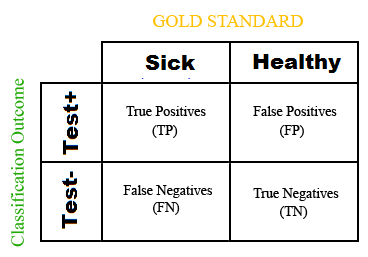
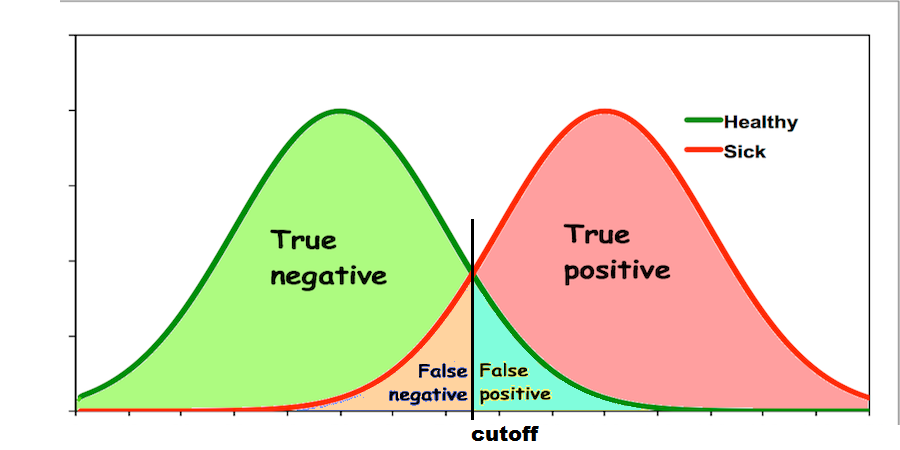

```{r setup, include=FALSE}
knitr::opts_chunk$set(echo = TRUE)

#-- setwd("~/../mystatistics")
```
  
## Two distributions - t-student test (t.test)

Here we will present 2 distributions and make them close togheter or far appart. The statistics that measures the distance between two normal distribuitons is t-student.  
<br><br>

```{r two.dist, echo=T}

source("support.R")

d1 = rnorm(200, mean=1, sd=1)
d2 = rnorm(200, mean=3, sd=.5)

data = data.frame(d1, d2)
options(digits=5)
head(data)

tt <- t.test(d1, d2)
print(tt)

print(paste("pvalue", tt$p.value))
print(paste("CI = [", paste(round(tt$conf.int,3), collapse = " to "), "] - confidence interval", sep=""))


diff = d1-d2
mu.diff = mean(diff)
ssd.diff = sd(diff)
sem.diff = ssd.diff / sqrt(length(diff))

print(paste("mean(difference) =", round(mu.diff,3) ))
print(paste("ssd(difference)  =", round(ssd.diff,3) ))
print(paste("SEM(difference)  =", round(sem.diff,3) ))

q.025 = qnorm(.025)

ci = mu.diff + c(1, -1) * q.025 * sem.diff
print(paste("CI calc = [", paste(round(ci,3), collapse = " to "), "] - confidence interval", sep=""))
print(paste("CI pack = [", paste(round(tt$conf.int,3), collapse = " to "), "] - confidence interval", sep=""))


my.boxplot(data, classX=c("one","two"), cols=c(1,2), title="normal distribution", ylab="%", colors=c("blue", "red"), is.log=F,ylim=NA)

```

<br>
Can we define if the distributions are sufficient far appart?
<br><br>

```{r two.dist2, echo=T}

print_2densities(d1, d2)  

```
<br><br>  

```{r stat1, echo=T}

healthy = rnorm(100, mean=1, sd=.7)
sick    = rnorm(100, mean=3, sd=.5)

healthy = round(healthy*100)
sick = round(sick*100)

tt <- t.test(healthy, sick)
print(tt)

print(paste("pvalue", tt$p.value))
print(paste("CI = [", paste(round(tt$conf.int,3), collapse = " to "), "] - confidence interval", sep=""))


diff = healthy-sick
mu.diff = mean(diff)
ssd.diff = sd(diff)
sem.diff = ssd.diff / sqrt(length(diff))

print(paste("mean(difference) =", round(mu.diff,3) ))
print(paste("ssd(difference)  =", round(ssd.diff,3) ))
print(paste("SEM(difference)  =", round(sem.diff,3) ))

q.025 = qnorm(.025)

ci = mu.diff + c(1, -1) * q.025 * sem.diff
print(paste("CI calc = [", paste(round(ci,3), collapse = " to "), "] - confidence interval", sep=""))
print(paste("CI pack = [", paste(round(tt$conf.int,3), collapse = " to "), "] - confidence interval", sep=""))


print_2densities(healthy, sick, title="healthy x sick", classes=c("healthy", "sick"))


```  
<br><br>  


<br><br>



<br><br>

<https://en.wikipedia.org/wiki/Confusion_matrix>  
<br><br>

### Sensitity  
<br>
Sensitivity, recall, hit rate, or true positive rate (TPR)  
<br>
$$Sensitivity = TPR = \frac{TP}{P} = {\frac{TP} {TP + FN}}$$  
<br>  


<br><br>

## Especifity  
<br>
specificity or true negative rate (TNR)
<br>
$$Especifity = TNR = \frac{TN}{N} = {\frac{TN} {TN + FP}}$$
<br>  


<br><br>

## Precision  
<br>
precision or positive predictive value (PPV)
<br>
$$Precision = PPV = {\frac{TP} {TP + FP}}$$
<br>  


<br><br>  

### ROC - Receiver Operating Curve  
<br>

In statistics, a receiver operating characteristic curve, i.e. ROC curve, is a graphical plot that illustrates the diagnostic ability of a binary classifier system as its discrimination threshold is varied.  
<br>
The ROC curve is created by plotting the true positive rate (TPR) against the false positive rate (FPR) at various threshold settings. The true-positive rate is also known as sensitivity, recall or probability of detection[1] in machine learning.  
<br>
<https://en.wikipedia.org/wiki/Receiver_operating_characteristic>  
<br><br>

  
<br>

```{r ROC, echo=T}

# lista = contigency_table(healthy, sick)
# names(lista)

healthy = rnorm(100, mean=1, sd=.3)
sick    = rnorm(100, mean=2, sd=.3)

lista = doRoc(healthy, sick, "healthy", "sick", "healthy", "sick", xlab="measure", isLog=F, titleAux="")
names(lista)

p1 = lista[["p1"]]
p2 = lista[["p2"]]

multiplot(p1,p2,layout=matrix(c(1,2),ncol=1, byrow=F))


``` 

<br><br>  

